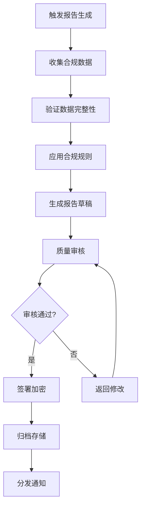

# EDAMS 合规报告生成操作手册

## 文档概述

本文档详细介绍如何生成和管理企业数据资产管理系统的合规报告。

## 1. 合规报告概览

### 1.1 支持的报告类型

| 报告类型 | 生成频率 | 适用标准 | 保留期限 |
|----------|----------|----------|----------|
| GDPR合规报告 | 每月 | GDPR | 7年 |
| 中国网络安全法报告 | 每季度 | CSL | 永久 |
| 数据安全法报告 | 每季度 | DSL | 永久 |
| SOC2合规报告 | 每年 | SOC2 Type II | 7年 |
| ISO 27001合规报告 | 每年 | ISO/IEC 27001 | 7年 |
| PCI DSS合规报告 | 每季度 | PCI DSS 4.0 | 3年 |
| 内部审计报告 | 每月 | 内部政策 | 5年 |
| 数据脱敏审计报告 | 每周 | 数据保护 | 2年 |

### 1.2 报告生成流程



## 2. 报告生成操作指南

### 2.1 自动生成合规报告

```bash
# 进入项目目录
cd /System/Volumes/Data/data/GitCode/enterprise-data-system

# 执行GDPR月报生成
./scripts/compliance/generate-gdpr-report.sh \
  --period=monthly \
  --date=2025-01 \
  --type=detailed \
  --output-format=pdf

# 执行中国网络安全法季报
./scripts/compliance/generate-csl-report.sh \
  --year=2025 \
  --quarter=Q1 \
  --language=zh-CN \
  --regulator=cyberspace-admin

# 执行SOC2年度合规报告
./scripts/compliance/generate-soc2-report.sh \
  --year=2025 \
  --auditor="Deloitte" \
  --scope=type-ii
```

### 2.2 手动触发报告生成

#### 通过Web界面生成
1. 登录EDAMS管理控制台：`https://edams.company.com/admin`
2. 导航到"合规管理" → "报告生成"
3. 选择报告类型和时间范围
4. 点击"生成报告"按钮
5. 等待处理完成并下载报告

#### 通过API生成
```bash
# 获取API访问令牌
TOKEN=$(curl -X POST https://edams.company.com/api/auth/login \
  -H "Content-Type: application/json" \
  -d '{"username":"admin","password":"your-password"}' \
  | jq -r '.data.access_token')

# 请求生成GDPR报告
curl -X POST https://edams.company.com/api/compliance/reports/generate \
  -H "Authorization: Bearer $TOKEN" \
  -H "Content-Type: application/json" \
  -d '{
    "report_type": "gdpr",
    "period": "2025-01",
    "format": "pdf",
    "include_attachments": true,
    "notification_email": "compliance@company.com"
  }'

# 检查报告生成状态
curl -X GET https://edams.company.com/api/compliance/reports/status/REPORT_ID \
  -H "Authorization: Bearer $TOKEN"
```

### 2.3 报告生成脚本详解

#### 主生成脚本：`generate-compliance-report.sh`
```bash
#!/bin/bash
# 用法
# ./generate-compliance-report.sh --type=gdpr --period=monthly --output=pdf

# 主要参数
# --type: 报告类型 (gdpr/csl/dsl/soc2/iso/pci/audit)
# --period: 期间 (daily/weekly/monthly/quarterly/yearly)
# --date: 具体日期或期间 (YYYY-MM)
# --format: 输出格式 (pdf/html/json/xlsx)
# --language: 语言 (zh-CN/en-US/ja-JP)
# --recipients: 接收邮箱列表
```

#### 报告配置验证脚本
```bash
# 验证合规报告配置
./scripts/compliance/validate-report-config.sh \
  --check-type=gdpr \
  --verbose

# 输出示例
# [INFO] 验证GDPR合规报告配置...
# [SUCCESS] 数据源配置正确
# [WARNING] 数据保留规则缺少删除确认
# [ERROR] 用户同意记录不完整
```

## 3. 报告内容与指标

### 3.1 GDPR合规报告指标

```yaml
gdpr_compliance_metrics:
  # 数据处理合法性 (Article 6)
  lawfulness_of_processing:
    user_consent_obtained: 98.5%  # 用户同意获取率
    legitimate_interest_documented: 95.2%
    contract_fulfillment_rate: 99.8%
  
  # 数据主体权利 (Articles 12-23)
  data_subject_rights:
    access_requests_completed: 247  # 数据访问请求完成数
    rectification_requests_processed: 32
    erasure_requests_fulfilled: 15
    data_portability_requests: 8
  
  # 数据保护影响评估 (Article 35)
  dpia:
    assessments_completed: 12
    high_risk_processing_identified: 3
    risk_mitigation_measures_implemented: 100%
  
  # 数据泄露通知 (Articles 33-34)
  data_breach_notification:
    breaches_detected: 2
    notifications_sent_within_72h: 100%
    regulatory_investigations: 0
  
  # 数据保护官 (Articles 37-39)
  dpo:
    dpo_appointed: true
    dpo_contact_accessibility: "24/7 via compliance@company.com"
    dpo_training_completed: "2025-01-15"
```

### 3.2 中国网络安全法报告指标

```yaml
csl_compliance_metrics:
  # 网络运营者义务
  network_operator_obligations:
    data_localization_compliance: 100%
    security_level_protection_mlps_3: true
    critical_information_infrastructure_ciip: false
  
  # 个人信息保护
  personal_information_protection:
    pii_encryption_rate: 98.7%
    consent_management_compliance: 96.3%
    data_breach_response_time: "< 24h"
  
  # 跨境数据传输
  cross_border_data_transfer:
    security_assessment_completed: true
    data_export_approvals: 12
    foreign_recipient_agreements_signed: 8
  
  # 网络安全事件处置
  cybersecurity_incident_handling:
    incident_reporting_compliance: 100%
    emergency_response_plan_tested: "2025-03-10"
    incident_resolution_time_p95: "4.3h"
```

## 4. 报告质量保证

### 4.1 数据验证检查清单

```bash
# 验证报告数据完整性
./scripts/compliance/validate-report-data.sh \
  --report-id=GDPR-2025-01 \
  --checks=all

# 检查清单包括：
# ✓ 数据来源完整性验证
# ✓ 时间范围一致性检查
# ✓ 指标计算正确性
# ✓ 异常值检测
# ✓ 趋势分析合理性
# ✓ 法规引用准确性
```

### 4.2 报告模板管理

```bash
# 管理报告模板
# 查看可用模板
./scripts/compliance/list-templates.sh \
  --type=gdpr \
  --version=latest

# 更新报告模板
./scripts/compliance/update-template.sh \
  --template=gdpr-monthly-template-v2.hcl \
  --backup=true

# 验证模板语法
./scripts/compliance/validate-template.sh \
  --template=/templates/gdpr/quarterly.hcl
```

## 5. 报告存储与归档

### 5.1 存储位置与安全

```yaml
report_storage_configuration:
  primary_storage:
    location: "s3://company-compliance-reports/edams/"
    encryption: "AES-256-GCM"
    access_control: "IAM role-based"
    versioning: enabled
    retention_policy: "7 years for GDPR, permanent for CSL"
  
  backup_storage:
    location: "azure://company-backup/compliance-reports/"
    replication: "geo-redundant"
    encryption: "customer-managed keys"
  
  audit_logs:
    location: "elasticsearch://company-logs/compliance-audit/"
    retention: "10 years"
```

### 5.2 报告检索与访问

```bash
# 搜索合规报告
./scripts/compliance/search-reports.sh \
  --query="GDPR 2025 data breach" \
  --date-start=2025-01-01 \
  --date-end=2025-03-31 \
  --sort-by=date-desc

# 导出报告信息
./scripts/compliance/export-report-metadata.sh \
  --format=csv \
  --include-content=metadata-only \
  --output=reports-2025-q1.csv
```

## 6. 告警与通知

### 6.1 报告生成失败的告警

```yaml
# prometheus告警规则 (部分)
alert: ComplianceReportGenerationFailed
  expr: increase(edams_compliance_report_generation_failed_total[1h]) > 0
  for: 0m
  labels:
    severity: critical
    compliance: "gdpr-30"
  annotations:
    summary: "合规报告生成失败"
    description: "GDPR合规报告生成失败，违反GDPR第30条规定"
```

### 6.2 自动通知配置

```bash
# 配置报告生成通知
./scripts/compliance/configure-notifications.sh \
  --report-type=gdpr \
  --notification-type=slack \
  --channel="#compliance-alerts" \
  --schedule=monthly \
  --recipients="compliance-team@company.com,legal@company.com"

# 测试通知功能
./scripts/compliance/test-notification.sh \
  --dry-run \
  --type=email \
  --subject="[测试] GDPR合规报告通知"
```

## 7. 合规报告生命周期管理

### 7.1 报告生成工作流

```yaml
report_lifecycle_workflow:
  step_1_collection:
    trigger: "cron(0 0 1 * ? *)"  # 每月第一天
    data_sources:
      - "prometheus compliance metrics"
      - "audit logs"
      - "user consent records"
      - "data processing activities"
    
  step_2_processing:
    validation: "automated data validation"
    transformation: "format to regulatory templates"
    calculation: "compliance score calculation"
    
  step_3_review:
    automated_review: "data quality checks"
    manual_review: "compliance officer approval"
    adjustment: "based on feedback"
    
  step_4_publication:
    signing: "digital signature application"
    encryption: "data at rest encryption"
    storage: "secure archival"
    
  step_5_distribution:
    internal_distribution: "executive dashboard"
    external_distribution: "regulatory authorities if required"
    retention: "according to retention policy"
```

### 7.2 保留与销毁策略

```bash
# 管理报告保留期限
./scripts/compliance/manage-retention.sh \
  --action=review-upcoming-expirations \
  --days-before-warning=30

# 安全销毁过期报告
./scripts/compliance/destroy-expired-reports.sh \
  --report-type=internal-audit \
  --expiry-date-before=2020-12-31 \
  --destruction-certificate=true \
  --audit-trail=true
```

## 8. 故障排除

### 8.1 常见问题与解决方案

| 问题 | 可能原因 | 解决方案 |
|------|----------|----------|
| 报告生成超时 | 数据量过大 | 1. 优化查询索引<br>2. 增加处理资源<br>3. 分批次处理 |
| 数据不一致 | 数据源延迟 | 1. 验证数据同步状态<br>2. 重新抓取数据<br>3. 使用缓存一致性机制 |
| 模板解析错误 | 模板语法错误 | 1. 验证模板语法<br>2. 更新模板版本<br>3. 检查依赖项 |
| 权限不足 | 访问控制配置 | 1. 验证IAM角色<br>2. 检查S3存储桶策略<br>3. 审核KMS密钥权限 |

### 8.2 诊断工具

```bash
# 报告生成诊断
./scripts/compliance/diagnose-report-generation.sh \
  --report-id=GDPR-2025-01 \
  --verbose \
  --include-logs

# 性能分析
./scripts/compliance/profile-report-performance.sh \
  --duration=30d \
  --output-format=flamegraph
```

## 9. 最佳实践

### 9.1 报告生成最佳实践

1. **定期验证**：每月验证数据源的完整性和准确性
2. **版本控制**：对报告模板进行严格的版本控制
3. **自动化测试**：建立报告生成的自动化测试套件
4. **安全审计**：定期进行报告生成流程的安全审计
5. **备份策略**：实现跨地域的报告备份策略

### 9.2 合规证据保留

1. 保留所有生成报告的数字签名和时间戳
2. 记录所有数据收集和处理的审计日志
3. 维护报告生成和分发的工作流记录
4. 保存所有系统配置变更记录
5. 归档所有合规相关的沟通记录

## 10. 附录

### 10.1 监管要求参考

- **GDPR**：EU Regulation 2016/679
- **网络安全法**：中华人民共和国网络安全法
- **数据安全法**：中华人民共和国数据安全法
- **个人信息保护法**：中华人民共和国个人信息保护法
- **SOC2**：AICPA Service Organization Control 2
- **ISO 27001**：ISO/IEC 27001:2022

### 10.2 相关脚本目录

```
scripts/compliance/
├── generate-gdpr-report.sh          # GDPR报告生成
├── generate-csl-report.sh           # 网络安全法报告
├── generate-dsl-report.sh           # 数据安全法报告
├── validate-report-data.sh          # 数据验证
├── configure-notifications.sh       # 通知配置
├── manage-retention.sh              # 保留管理
├── search-reports.sh                # 报告搜索
└── diagnose-report-generation.sh    # 诊断工具
```

### 10.3 紧急联系方式

| 角色 | 联系人 | 联系方式 | 可用时间 |
|------|--------|----------|----------|
| 合规负责人 | 张三 | zhangsan@company.com<br>+86 138 0013 8000 | 24/7 |
| 技术负责人 | 李四 | lisi@company.com<br>+86 139 0013 9000 | 工作日 9-18 |
| 法律顾问 | 王五 | wangwu-law@company.com<br>+86 139 0023 8000 | 紧急响应 |
| 数据保护官 | 赵六 | dpo@company.com | 24/7 |

---

**最后更新**：2025年4月10日  
**文档版本**：v2.1.0  
**适用环境**：EDAMS生产环境  
**维护团队**：合规与技术团队