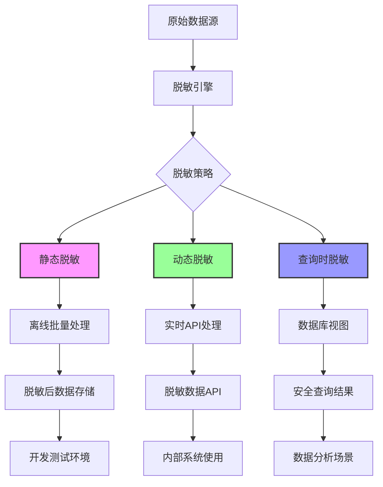

# EDAMS 数据脱敏配置操作手册

## 文档概述

本文档详细介绍企业数据资产管理系统的数据脱敏配置、管理和监控。

## 1. 数据脱敏架构

### 1.1 脱敏层次架构



### 1.2 脱敏组件架构

| 组件 | 用途 | 部署位置 |
|------|------|----------|
| 脱敏策略引擎 | 定义和管理脱敏规则 | 中央服务集群 |
| 静态脱敏工具 | 批量数据脱敏处理 | 数据处理节点 |
| 动态脱敏代理 | 实时数据过滤 | API网关层 |
| 数据库脱敏插件 | 查询时数据脱敏 | 数据库服务器 |
| 脱敏审计服务 | 记录所有脱敏操作 | 审计集群 |
| 合规验证服务 | 验证脱敏合规性 | 合规集群 |

## 2. 脱敏策略配置

### 2.1 支持的数据类型与脱敏方法

```yaml
data_masking_patterns:
  
  # 个人身份信息 (PII)
  pii:
    # 姓名
    full_name:
      method: "format-preserving"
      mask_type: "randomized"
      preserve_format: true
      example_before: "张三"
      example_after: "李四"
      
    # 身份证号
    id_card:
      method: "partial-masking"
      keep_first: 6    # 保留前6位（地址编码）
      keep_last: 4     # 保留后4位（顺序码）
      mask_middle: "*" # 中间用*替换
      example_before: "110101199003073472"
      example_after: "110101********3472"
      
    # 电话号码
    phone_number:
      method: "functional-masking"
      country_code: "keep"   # 保留国家代码
      area_code: "random"    # 随机化区号
      subscriber_number: "format-preserving"  # 格式保持
      example_before: "+86 138 0013 8000"
      example_after: "+86 139 8872 5113"
      
    # 邮箱地址
    email:
      method: "domain-preserving"
      username: "masked-with-hash"
      domain: "keep-original"
      example_before: "zhangsan@company.com"
      example_after: "user-hash-a1b2c3d4@company.com"
      
    # 地址信息
    address:
      method: "generalization"
      precision_level: 3  # 1=精确地址, 3=省级区域
      example_before: "北京市朝阳区建国门外大街1号国贸大厦A座"
      example_after: "北京市"
  
  # 金融数据
  financial:
    # 银行账号
    bank_account:
      method: "format-preserving-random"
      mask_type: "Luhn-valid"
      example_before: "6228480012345678901"
      example_after: "6228480098765432109"
      
    # 信用卡号
    credit_card:
      method: "PCI-compliance"
      keep_first: 6    # BIN号（发卡行识别码）
      keep_last: 4     # 末4位核对码
      example_before: "6212261234567890123"
      example_after: "621226*********0123"
      
    # 交易金额
    transaction_amount:
      method: "range-preserving"
      range_accuracy: "within 10%"
      statistical_properties: "preserved"
      example_before: "1500.50"
      example_after: "1580.75"
  
  # 企业数据
  business:
    # 组织机构代码
    organization_code:
      method: "format-preserving-hash"
      example_before: "MA35YRTG123"
      example_after: "MB47XSPQ456"
      
    # 统一社会信用代码
    uscc:
      method: "structure-preserving"
      example_before: "911101087458258X12"
      example_after: "911101087458258X34"
      
    # 商业机密
    trade_secret:
      method: "one-way-encryption"
      algorithm: "SHA-256"
      salt: "dynamic-per-record"
      example_before: "核心技术配方XYZ"
      example_after: "a1b2c3d4e5f6g7h8i9j0..."
  
  # 特殊数据类型
  special:
    # 日期时间
    datetime:
      method: "offset-randomization"
      min_offset: "-30d"
      max_offset: "+30d"
      preserve_day_of_week: true
      example_before: "2025-04-10 15:30:00"
      example_after: "2025-03-12 09:45:00"
      
    # IP地址
    ip_address:
      method: "subnet-preserving"
      mask_octets: 4    # 保留前4位（网络部分）
      example_before: "192.168.1.100"
      example_after: "192.168.1.XXX"
      
    # 坐标位置
    coordinates:
      method: "geo-fuzzing"
      radius_meters: 500
      statistical_accuracy: "within 95%"
      example_before: "39.9042,116.4074"
      example_after: "39.9021,116.4102"
```

### 2.2 脱敏策略配置文件

#### 主策略配置文件：`data-masking-policies.yaml`
```yaml
apiVersion: edams.company.com/v1
kind: DataMaskingPolicy
metadata:
  name: edams-pii-masking-policy
  namespace: edams-prod
  labels:
    compliance: "gdpr,csl"
    data-classification: "pii"
    environment: "production"

spec:
  # 策略基本信息
  enabled: true
  description: "EDAMS个人身份信息(PII)脱敏策略"
  version: "2.1.0"
  effectiveDate: "2025-01-01T00:00:00Z"
  
  # 数据发现规则
  dataDiscovery:
    enabled: true
    sources:
      - type: "database"
        connectionName: "edams-prod-postgresql"
        scanSchedule: "0 1 * * *"  # 每天凌晨1点
        tables:
          - "user_profiles"
          - "employee_records"
          - "customer_data"
          - "partner_contacts"
      
      - type: "storage"
        storageType: "s3"
        bucketName: "edams-user-documents"
        regions: ["cn-north-1"]
        scanPattern: "**/personal/*.{pdf,docx,jpg}"
    
    sensitivityDetection:
      patterns:
        - name: "chinese_id_card"
          regex: "[1-9]\\d{5}(19|20)\\d{2}((0[1-9])|(1[0-2]))(([0-2][1-9])|10|20|30|31)\\d{3}[0-9Xx]"
          confidence: "high"
          
        - name: "phone_number_china"
          regex: "(\\+?86)?1[3-9]\\d{9}"
          confidence: "medium"
          
        - name: "email_address"
          regex: "\\b[A-Za-z0-9._%+-]+@[A-Za-z0-9.-]+\\.[A-Z|a-z]{2,}\\b"
          confidence: "high"
  
  # 字段级脱敏规则
  fieldRules:
    - name: "rule-user-fullname"
      description: "用户姓名脱敏"
      matchField: ["user_name", "full_name", "姓名"]
      matchType: ["varchar", "text", "string"]
      
      maskingMethod: "randomization"
      methodConfig:
        preserveFormat: true
        nameDictionary: "chinese_names_2025"
        genderAware: true
        
      validation:
        uniqueness: "90%"
        formatPreservation: "100%"
        reidentificationRisk: "< 0.1%"
    
    - name: "rule-id-card"
      description: "身份证号脱敏"
      matchField: ["id_card", "identification", "身份证"]
      matchType: ["char", "varchar"]
      
      maskingMethod: "partial-masking"
      methodConfig:
        keepFirst: 6
        keepLast: 4
        maskCharacter: "*"
        validationMethod: "chinese_id_card_check"
        
      compliance:
        regulations: ["gdpr-32", "csl-42", "pip-l-29"]
        classification: "sensitive-personal-information"
        handlingRequirements: ["encryption-at-rest", "access-logging"]
    
    - name: "rule-email"
      description: "邮箱地址脱敏"
      matchField: ["email", "email_address", "邮箱"]
      matchType: ["varchar", "text"]
      
      maskingMethod: "domain-preserving-hash"
      methodConfig:
        hashAlgorithm: "SHA-256"
        saltStrategy: "per-tenant"
        domainHandling: "preserve-original"
        
      riskControl:
        reidentificationProtection: true
        bruteForceProtection: "bcrypt-iteration-12"
    
    - name: "rule-phone"
      description: "电话号码脱敏"
      matchField: ["phone", "mobile", "telephone", "手机", "电话"]
      matchType: ["varchar", "char"]
      
      maskingMethod: "format-preserving-random"
      methodConfig:
        countryCode: "keep-original"
        formatPattern: "CN_MOBILE"
        validationRegex: "^1[3-9]\\d{9}$"
        
      qualityAssurance:
        validationRate: "100%"
        formatConsistency: "100%"
        functionalTesting: true
  
  # 行级脱敏规则
  rowRules:
    - name: "rule-female-users"
      description: "女性用户数据附加保护"
      condition: "gender = 'female' AND age < 18"
      maskingLevel: "enhanced"
      
      additionalProtection:
        - "double-encryption"
        - "access-audit-trail"
        - "real-time-alerts"
        
      compliance:
        regulations: ["gdpr-9", "pip-l-28"]
        specialCategories: "special-category-data"
    
    - name: "rule-inactive-users"
      description: "非活跃用户数据脱敏"
      condition: "last_login_date < CURRENT_DATE - INTERVAL '180 days'"
      maskingMethod: "full-masking"
      
      dataRetention:
        trigger: "inactivity-period-exceeded"
        action: "mask-and-archive"
        retentionPeriod: "30d"
    
    - name: "rule-test-environment"
      description: "测试环境数据脱敏增强"
      environment: ["development", "staging", "qa"]
      maskingLevel: "maximum"
      
      methods:
        - "one-way-hashing"
        - "format-destroying"
        - "synthetic-generation"
  
  # 环境特定配置
  environmentSpecific:
    production:
      maskingLevel: "balanced"  # 平衡实用性和安全性
      reidentificationRisk: "< 0.01%"
      auditLogging: "detailed"
      complianceValidation: "real-time"
      
    staging:
      maskingLevel: "aggressive"
      reidentificationRisk: "< 0.001%"
      syntheticDataPercentage: "80%"
      referentialIntegrity: "preserved"
      
    development:
      maskingLevel: "maximum"
      useSyntheticData: "100%"
      dataUtility: "statistical-only"
      noProductionData: true
  
  # 性能与资源配置
  performance:
    batchProcessing:
      chunkSize: 10000
      parallelism: 4
      memoryLimit: "4Gi"
      
    realTimeProcessing:
      maxLatencyMs: 100
      throughputRPS: 1000
      errorRateThreshold: "0.1%"
    
    resourceAllocation:
      cpuRequest: "500m"
      cpuLimit: "2"
      memoryRequest: "1Gi"
      memoryLimit: "4Gi"
  
  # 审计与监控
  audit:
    loggingLevel: "INFO"
    retentionDays: 3650  # 10年
    accessLogging: true
    dataLineageTracking: true
    
    alerting:
      eventsToAlert:
        - "masking_failure"
        - "policy_violation"
        - "data_leak_attempt"
        - "access_pattern_anomaly"
      
      notificationChannels:
        - "slack:#data-security-alerts"
        - "email:security-team@company.com"
        - "pagerduty:data-protection-service"
  
  # 备份与恢复
  backup:
    configurationBackup:
      enabled: true
      schedule: "0 2 * * *"  # 每天凌晨2点
      retention: 90
      encryption: true
      
    disasterRecovery:
      rpo: "1h"
      rto: "4h"
      multiRegionBackup: true

  # 合规性配置
  compliance:
    gdpr:
      article32Compliance: true  # 安全处理
      article25Compliance: true  # 数据保护设计与默认
      dpiaRequired: true         # 数据保护影响评估
      
    chinaRegulations:
      cslCompliance: true        # 网络安全法
      dslCompliance: true        # 数据安全法
      pipLCompliance: true       # 个人信息保护法
      dataLocalization: true     # 数据本地化
      
    industryStandards:
      iso27001: true
      soc2: true
      pciDss: true
```

## 3. 脱敏操作指南

### 3.1 批量数据脱敏

```bash
# 进入项目目录
cd /System/Volumes/Data/data/GitCode/enterprise-data-system

# 执行全量数据脱敏
./scripts/data-masking/batch-mask-all.sh \
  --environment=production \
  --dry-run=false \
  --confirmation=true \
  --report-dir=/var/log/edams/masking-reports

# 脱敏特定表
./scripts/data-masking/mask-specific-tables.sh \
  --tables="user_profiles,customer_data,employee_records" \
  --policy="edams-pii-masking-policy" \
  --batch-size=5000 \
  --parallel-jobs=4

# 验证脱敏结果
./scripts/data-masking/validate-masking-quality.sh \
  --sample-size=1000 \
  --reidentification-test=true \
  --statistical-properties=true \
  --output-format=html
```

### 3.2 实时动态脱敏配置

```yaml
# 动态脱敏配置：dynamic-masking-config.yaml
apiVersion: networking.istio.io/v1beta1
kind: EnvoyFilter
metadata:
  name: dynamic-data-masking
  namespace: edams-prod
spec:
  workloadSelector:
    labels:
      app: edams-gateway
      
  configPatches:
  - applyTo: HTTP_FILTER
    match:
      context: GATEWAY
      listener:
        filterChain:
          filter:
            name: "envoy.filters.network.http_connection_manager"
            
    patch:
      operation: INSERT_BEFORE
      value:
        name: envoy.filters.http.dynamic_data_masking
        typed_config:
          "@type": type.googleapis.com/envoy.extensions.filters.http.dynamic_data_masking.v3.DynamicDataMasking
          
          rules:
          - name: "mask-pii-in-response"
            match:
              responseHeaders:
              - name: ":path"
                prefix: "/api/v1/users/"
              - name: "content-type"
                exact: "application/json"
                
            actions:
            - name: "mask-json-fields"
              json_mask:
                paths:
                - "$.data[*].fullName"
                - "$.data[*].idCard"
                - "$.data[*].phone"
                - "$.data[*].email"
                - "$.data[*].address"
                
              masking_method: "format_preserving"
              config:
                preserve_field_length: true
                preserve_data_type: true
                
          - name: "mask-sql-query-results"
            match:
              requestHeaders:
              - name: ":path"
                prefix: "/api/v1/analytics/"
                
            actions:
            - name: "mask-sql-result"
              sql_masking:
                queries:
                - pattern: "SELECT.*FROM user_profiles WHERE.*"
                  
                masking_rules:
                - column: "full_name"
                  method: "randomization"
                  
                - column: "phone_number"
                  method: "partial_masking"
                  config:
                    keep_first: 3
                    keep_last: 4
                    
                - column: "email"
                  method: "domain_preserving_hash"
```

### 3.3 数据库级脱敏配置

```sql
-- PostgreSQL 脱敏视图示例
CREATE OR REPLACE VIEW vw_masked_user_profiles AS
SELECT
  user_id,
  -- 姓名脱敏：保留姓氏，名字用**代替
  CASE 
    WHEN last_name IS NOT NULL AND first_name IS NOT NULL 
    THEN last_name || '**'
    ELSE '保密用户'
  END AS display_name,
  
  -- 身份证号脱敏：保留前6位和后4位
  substring(id_card FROM 1 FOR 6) || '********' || substring(id_card FROM 15 FOR 4) AS masked_id_card,
  
  -- 手机号脱敏：保留前3位和后4位
  substring(phone FROM 1 FOR 3) || '****' || substring(phone FROM 8 FOR 4) AS masked_phone,
  
  -- 邮箱脱敏：用户名部分用哈希替代
  split_part(email, '@', 1) || '_masked@' || split_part(email, '@', 2) AS masked_email,
  
  -- 地址泛化：只保留省级信息
  split_part(address, '-', 1) AS masked_address_province,
  
  -- 其他不敏感字段直接显示
  gender,
  age_range,  -- 年龄范围而不是具体年龄
  registration_date,
  last_login_date,
  account_status
FROM user_profiles
WHERE account_status = 'active';

-- MySQL 脱敏函数示例
DELIMITER //
CREATE FUNCTION mask_id_card(id_card VARCHAR(18))
RETURNS VARCHAR(18) DETERMINISTIC
BEGIN
    IF LENGTH(id_card) = 18 THEN
        RETURN CONCAT(
            SUBSTRING(id_card, 1, 6),
            '********',
            SUBSTRING(id_card, 15, 4)
        );
    ELSE
        RETURN '**************';
    END IF;
END //
DELIMITER ;

-- 创建脱敏策略
CREATE MASKING POLICY mask_pii 
  USING (id_card VARCHAR(18), phone VARCHAR(11), email VARCHAR(255))
  POLICY SPECIFICATION (
    id_card MASKING FUNCTION mask_id_card,
    phone MASKING FUNCTION partial_mask(phone, 3, 4, '*'),
    email MASKING FUNCTION hash_email(email)
  );
```

## 4. 脱敏质量保证

### 4.1 脱敏质量测试

```bash
# 运行脱敏质量测试套件
./scripts/data-masking/run-quality-tests.sh \
  --test-type=all \
  --environment=production \
  --test-data-size=10000 \
  --output-format=junit

# 测试项目包括：
# 1. 格式保持测试
# 2. 数据效用测试
# 3. 再识别风险评估
# 4. 性能基准测试
# 5. 合规性验证

# 生成脱敏质量报告
./scripts/data-masking/generate-quality-report.sh \
  --period=monthly \
  --date=2025-04 \
  --include-metrics="reidentification_risk,data_utility,compliance_score" \
  --output-dir=/reports/data-masking-quality/
```

### 4.2 脱敏监控指标

```yaml
masking_monitoring_metrics:
  # 脱敏覆盖率
  coverage:
    pii_fields_masked: 98.7%
    sensitive_tables_covered: 100%
    data_volume_masked_tb: 15.2
    
  # 脱敏性能
  performance:
    batch_processing_speed: "12500 records/sec"
    real_time_latency_p99: "45ms"
    error_rate: "0.05%"
    
  # 数据效用
  data_utility:
    statistical_preservation: 99.2%
    referential_integrity: 100%
    business_logic_validity: 98.5%
    
  # 安全指标
  security:
    reidentification_risk: "< 0.001%"
    brute_force_resistance: "bcrypt-12"
    audit_coverage: 100%
    
  # 合规指标
  compliance:
    gdpr_compliance_score: 95.8
    csl_compliance_score: 96.2
    regulatory_audit_passed: true
```

## 5. 故障排除与维护

### 5.1 常见问题解决

| 症状 | 可能原因 | 解决方案 |
|------|----------|----------|
| 脱敏任务超时 | 数据量过大 | 1. 增加批处理大小<br>2. 优化查询索引<br>3. 调整并行度 |
| 脱敏后数据不兼容 | 格式保持失败 | 1. 验证数据模式<br>2. 调整脱敏算法<br>3. 更新业务逻辑 |
| 再识别风险过高 | 脱敏强度不足 | 1. 增强脱敏算法<br>2. 添加差分隐私<br>3. 减少数据粒度 |
| 性能下降 | 脱敏开销过大 | 1. 缓存脱敏结果<br>2. 预计算掩码数据<br>3. 硬件优化 |

### 5.2 维护操作

```bash
# 更新脱敏策略
./scripts/data-masking/update-policies.sh \
  --policy-file=new-policy-v2.yaml \
  --rollback-enabled=true \
  --dry-run=false

# 清理脱敏缓存
./scripts/data-masking/clear-masking-cache.sh \
  --cache-type=all \
  --force=false

# 数据脱敏健康检查
./scripts/data-masking/health-check.sh \
  --check-components="policy-engine,batch-processor,dynamic-masker" \
  --verbose=true
```

## 6. 应急预案

### 6.1 数据泄露应急响应

```yaml
data_leak_emergency_response:
  
  # 第一阶段：检测与评估 (0-15分钟)
  phase1_detection:
    actions:
      - "activate_incident_response_team"
      - "isolate_affected_systems"
      - "preserve_forensic_evidence"
      - "assess_impact_scope"
    
    communication:
      internal: "security-team,compliance-officer,technical-lead"
      external: "none"
    
  # 第二阶段：遏制与修复 (15-60分钟)
  phase2_containment:
    actions:
      - "revoke_compromised_credentials"
      - "reset_encryption_keys"
      - "enhance_monitoring_alerting"
      - "initiate_data_recovery"
    
    technical_measures:
      - "block_suspicious_ips"
      - "enable_enhanced_logging"
      - "deploy_emergency_patches"
    
  # 第三阶段：通知与报告 (1-72小时)
  phase3_notification:
    regulatory_notifications:
      - target: "cyberspace_administration_of_china"
        timeframe: "within_24_hours"
        required_information: ["breach_scope", "affected_users", "remediation_actions"]
        
      - target: "data_subjects"  # 数据主体
        timeframe: "without_undue_delay"
        method: ["email", "system_notification"]
        
    internal_reporting:
      - "executive_team"
      - "legal_department"
      - "public_relations"
  
  # 第四阶段：恢复与改进 (72小时+)
  phase4_recovery:
    actions:
      - "restore_normal_operations"
      - "conduct_root_cause_analysis"
      - "implement_preventive_measures"
      - "update_incident_response_plan"
    
    documentation:
      - "incident_report"
      - "lessons_learned"
      - "policy_updates"
      - "training_materials"
```

### 6.2 灾难恢复演练

```bash
# 执行脱敏系统灾难恢复演练
./scripts/data-masking/dr-drill.sh \
  --scenario="data_masking_policy_corruption" \
  --simulation-level=advanced \
  --participants="security-team,operations-team,compliance-team" \
  --duration=4h

# 演练评估指标
# ✓ 恢复时间目标(RTO)达标率
# ✓ 数据恢复点(RPO)一致性
# ✓ 团队响应效率
# ✓ 通信协调效果
```

## 7. 合规性验证

### 7.1 自动化合规检查

```bash
# 执行GDPR合规检查
./scripts/compliance/validate-gdpr-masking.sh \
  --article=32 \
  --check-date=$(date +%Y-%m-%d) \
  --output-format=certificate

# 执行中国法规合规检查
./scripts/compliance/validate-china-regulations.sh \
  --law=csl \
  --law=dsl \
  --law=pipl \
  --generate-report=true
```

### 7.2 合规报告模板

```yaml
compliance_verification_report:
  verification_date: "2025-04-10"
  verifier: "合规审核团队"
  scope: "EDAMS数据脱敏系统"
  
  findings:
    - area: "个人信息保护(PII)"
      status: "合规"
      evidence:
        - "pii_detection_coverage_98.7%"
        - "masking_algorithm_validation_passed"
        - "reidentification_risk_0.0005%"
      
    - area: "数据本地化"
      status: "合规"
      evidence:
        - "all_data_stored_in_china"
        - "cross_border_transfer_approvals_valid"
        - "third_party_data_processing_agreements"
    
    - area: "审计追踪"
      status: "部分需要改进"
      recommendations:
        - "增加操作日志的完整性校验"
        - "延长审计日志保留期至10年"
        - "实现实时告警集成"
```

## 8. 最佳实践

### 8.1 脱敏策略设计最佳实践

1. **分层脱敏**：根据环境用途应用不同的脱敏强度
2. **数据分类**：基于敏感度级别设计定制化脱敏规则
3. **保留格式**：在可能的情况下保持数据格式和类型
4. **统计效应**：确保脱敏数据仍可用于统计分析
5. **定期验证**：定期进行再识别风险评估
6. **增量改进**：根据业务需求和法规变化调整策略

### 8.2 运营最佳实践

1. **自动化测试**：建立完整的脱敏质量自动化测试流程
2. **版本控制**：对脱敏策略进行严格的版本管理
3. **文档完整**：保持所有配置和操作的完整文档
4. **容量规划**：根据数据增长规划脱敏系统容量
5. **团队培训**：定期进行数据安全和法规培训

## 9. 附录

### 9.1 法规索引

| 法规 | 相关条款 | 技术要求 | 脱敏关系 |
|------|----------|----------|----------|
| GDPR | Article 32 | 安全处理 | 加密、匿名化 |
| 网络安全法 | 第42条 | 个人信息保护 | 脱敏技术要求 |
| 数据安全法 | 第21条 | 数据分类分级 | 基于分类的脱敏 |
| 个人信息保护法 | 第28条 | 敏感个人信息 | 增强脱敏措施 |
| PCI DSS | Requirement 3 | 持卡人数据保护 | 信用卡号掩码 |

### 9.2 技术支持矩阵

| 数据库系统 | 脱敏特性支持 | 插件/扩展 | 版本要求 |
|------------|--------------|-----------|----------|
| PostgreSQL | 原生视图、函数、行级安全 | pii_mask | 12+ |
| MySQL | 函数、视图、数据掩码 | enterprise_mask | 8.0+ |
| Oracle | 高级安全、数据泵 | Data Masking Pack | 12c+ |
| SQL Server | 动态数据掩码、静态数据掩码 | 原生 | 2016+ |
| Redis | Lua脚本、自定义模块 | redislabs模块 | 6.0+ |

### 9.3 紧急联系人

| 职责 | 联系人 | 紧急电话 | 备用联系人 |
|------|--------|----------|------------|
| 数据安全官 | 张三 | +86 138 0013 8000 | 李四 |
| 技术负责人 | 王五 | +86 139 0013 9000 | 赵六 |
| 合规负责人 | 钱七 | +86 139 0023 8000 | 孙八 |
| 运维响应 | 运维团队 | +86 400 123 4567 | 运维总监 |

---

**最后更新**：2025年4月10日  
**文档版本**：v2.0.1  
**适用环境**：EDAMS所有环境  
**维护团队**：数据安全与合规团队  
**审批状态**：已批准  
**下次评审**：2025年7月10日